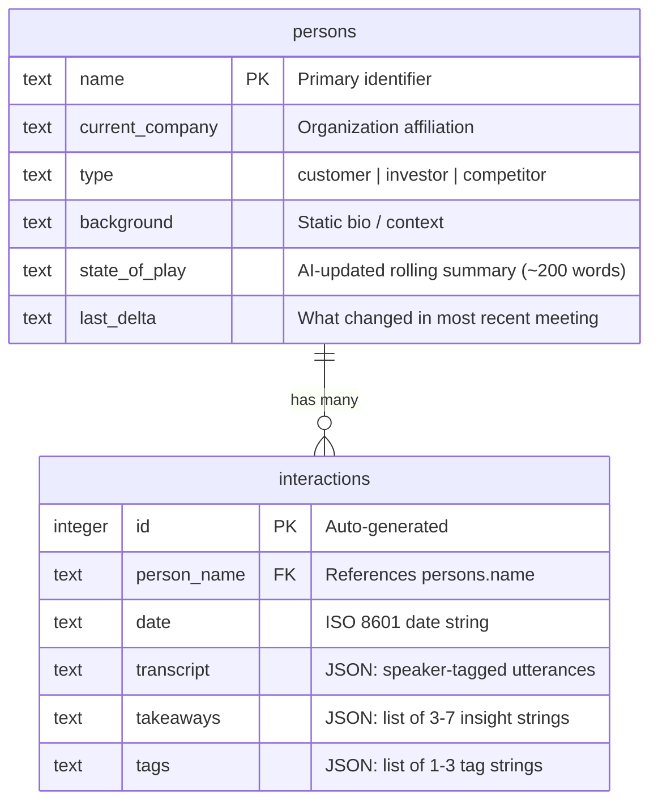
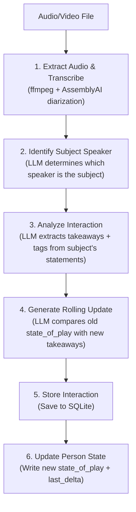

# Rolodex

An AI-powered Interview Intelligence System that transforms raw interview recordings into actionable insights organized by individual people.

## Overview

Rolodex is a person-centric knowledge management tool for tracking how customers, investors, and competitors think over time. Instead of managing transcripts by file, it maintains rolling AI-generated summaries ("State of Play") for each person and tracks what's changed since the last interaction ("Last Delta").

**Use Case**: Business stakeholders (founders, researchers) who conduct frequent interviews and need to identify patterns, extract market intelligence, and understand evolving perspectives across multiple conversations.

## Architecture

```
rolodex/
├── backend/
│   ├── main.py                 # CLI entry point (Click-based + one-shot VFS commands)
│   ├── vfs.py                  # Virtual filesystem resolver
│   ├── shell.py                # Interactive REPL shell
│   ├── config.py               # Configuration and enums
│   ├── models.py               # Data classes (Person, Interaction, InteractionAnalysis, RollingUpdate)
│   ├── database.py             # SQLite storage layer
│   ├── prompts.py              # LLM prompt templates
│   ├── local_secrets.py        # API keys (gitignored)
│   ├── services/
│   │   ├── ingestion.py        # Main pipeline orchestrator
│   │   ├── transcription.py    # Audio extraction & transcription
│   │   └── analysis.py         # LLM-based analysis (speaker ID, interaction, rolling update)
│   └── data/
│       └── rolodex.db          # SQLite database
└── README.md
```

## Virtual Filesystem

Rolodex exposes data as a navigable virtual filesystem. People are directories, interactions are identified by date, and standard commands (`ls`, `cd`, `cat`, `tree`) let you browse everything.

```
/                                           # root — lists all people
/John_Doe/                             # person directory
/John_Doe/info                         # company, type, interaction count
/John_Doe/background                   # static bio
/John_Doe/state                        # AI-generated state_of_play
/John_Doe/delta                        # last_delta
/John_Doe/interactions/                # lists interactions by date
/John_Doe/interactions/2026-01-05/     # single interaction dir
/John_Doe/interactions/2026-01-05/transcript
/John_Doe/interactions/2026-01-05/takeaways
/John_Doe/interactions/2026-01-05/tags
```

- Spaces in names become underscores in paths (`John Doe` → `John_Doe`)
- Date collisions: first interaction on a date = bare date (`2026-01-05`), subsequent = `2026-01-05_2`, `2026-01-05_3`

## Data Model



### Person

The core entity representing an individual contact:

- **name** (PK): Primary identifier
- **current_company**: Organization affiliation
- **type**: `customer` | `investor` | `competitor`
- **background**: Static bio / context
- **state_of_play**: AI-generated ~200-word rolling summary that evolves with each interaction
- **last_delta**: What changed in the most recent meeting
- **interaction_ids** (derived, not stored): List of linked interaction IDs, populated by querying the interactions table

### Interaction

A single recorded conversation:

- **id** (PK): Auto-incremented integer
- **person_name** (FK): References `persons.name`
- **date**: When the interaction occurred (stored as ISO 8601 string)
- **transcript**: Speaker-tagged utterances stored as JSON with structure:
  ```json
  {
    "text": "Full transcript text",
    "utterances": [
      {"speaker": "Jane Smith", "text": "...", "start": 0, "end": 1000}
    ]
  }
  ```
- **takeaways**: 3-7 key insights extracted by LLM (stored as JSON array)
- **tags**: 1-3 thematic tags (stored as JSON array of strings)

### Internal Dataclasses

These are used within the pipeline but not persisted directly:

- **InteractionAnalysis**: Holds `takeaways` (list[str]) and `tags` (list[Tag]) returned by the analysis LLM call
- **RollingUpdate**: Holds `delta` (str) and `updated_state` (str) returned by the rolling update LLM call

## Pipeline Flow

The ingestion pipeline processes recordings in 6 steps:



### Step Details

| Step | Module | LLM Call | Output |
|------|--------|----------|--------|
| 1. Extract & Transcribe | `transcription.py` | No (AssemblyAI API) | Speaker-diarized transcript dict |
| 2. Identify Speaker | `analysis.py` | Yes (`SpeakerIdentificationSchema`) | Speaker letter (A, B, C...) |
| 3. Analyze Interaction | `analysis.py` | Yes (`InteractionAnalysisSchema`) | Takeaways + tags |
| 4. Rolling Update | `analysis.py` | Yes (`RollingUpdateSchema`) | Delta + updated state |
| 5. Store Interaction | `database.py` | No | Interaction row in SQLite |
| 6. Update Person | `database.py` | No | Updated person row in SQLite |

After speaker identification (step 2), speakers are relabeled: the subject gets their real name, others become "Interviewer 1", "Interviewer 2", etc.

## Installation

### Prerequisites
- Python 3.10+
- ffmpeg (for audio extraction)
- AssemblyAI API key
- Google Gemini API key

### Setup

1. Clone the repository:
```bash
git clone <repo-url>
cd rolodex
```

2. Install dependencies:
```bash
pip install -r requirements.txt
```

3. Configure API keys in `backend/local_secrets.py`:
```python
ASSEMBLYAI_API_KEY = "your-assemblyai-key"
GEMINI_API_KEY = "your-gemini-key"
```

## Usage

All commands run from the `backend/` directory.

### Interactive Shell

Start the REPL for filesystem-style navigation with tab completion and command history:

```bash
python main.py shell
```

```
rolodex:/$ ls
Jane_Smith/
John_Doe/

rolodex:/$ cd John_Doe
rolodex:/John_Doe$ ls
info
background
state
delta
interactions/

rolodex:/John_Doe$ cat info
Name:         John Doe
Company:      Ford
Type:         customer
Interactions: 1

rolodex:/John_Doe$ cd interactions
rolodex:/John_Doe/interactions$ ls
2026-01-05/

rolodex:/John_Doe/interactions$ cat 2026-01-05/takeaways
- Ford prioritizes a large self-performance technician base...
- The company faces significant challenges in hiring qualified technicians...

rolodex:/John_Doe/interactions$ tree /
.
├── Jane_Smith/
│   ├── info
│   ├── background
│   ├── state
│   ├── delta
│   └── interactions/
└── John_Doe/
    ├── info
    ├── background
    ├── state
    ├── delta
    └── interactions/
```

Shell commands:

| Command | Description |
|---------|-------------|
| `ls [path]` | List directory contents |
| `cd [path]` | Change directory (supports `..`, `.`, absolute and relative paths) |
| `cat <path>` | Show file contents |
| `tree [path]` | Show directory tree |
| `pwd` | Print working directory |
| `ingest <file> --person <name>` | Ingest a recording |
| `mkperson <name> --company <c> --type <t>` | Create a person |
| `search tag <tag>` | Search interactions by tag |
| `tags` | List available tags |
| `help` | Show help |
| `exit` | Exit the shell |

### One-Shot Commands

Browse the virtual filesystem without entering the shell:

```bash
# List all people
python main.py ls /

# List a person's files
python main.py ls /John_Doe

# View person info
python main.py cat /John_Doe/info

# View a transcript
python main.py cat /John_Doe/interactions/2026-01-05/transcript

# View takeaways
python main.py cat /John_Doe/interactions/2026-01-05/takeaways
```

### Person Management

```bash
# Create a new person
python main.py person create "Jane Doe" --company "Acme Inc" --type customer --background "VP of Engineering, 10 years in SaaS"

# List all people
python main.py person list
python main.py person list --type investor

# Show person details and state
python main.py person show "Jane Doe"
```

### Recording Ingestion

```bash
# Process a recording for a person
python main.py ingest path/to/recording.m4a --person "Jane Doe" --date 2024-01-15
```

### Viewing Transcripts

```bash
# View all transcripts for a person
python main.py transcript "Jane Doe"

# View a specific interaction's transcript by ID
python main.py transcript "Jane Doe" --id 1
```

### Search & Discovery

```bash
# Find interactions by tag
python main.py search tag pricing
python main.py search tag competitors

# Show all interactions with a person
python main.py search person "Jane Doe"

# List available tags
python main.py tags
```

## Key Modules

| Module | Responsibility |
|--------|----------------|
| `backend/main.py` | CLI interface with Click commands and one-shot VFS commands |
| `backend/vfs.py` | Virtual filesystem resolver — maps paths to database content |
| `backend/shell.py` | Interactive REPL with prompt_toolkit (tab completion, history) |
| `backend/config.py` | Constants, enums (PersonType, Tag), model token limits |
| `backend/models.py` | Dataclass definitions (Person, Interaction, InteractionAnalysis, RollingUpdate) |
| `backend/database.py` | SQLite CRUD operations |
| `backend/prompts.py` | LLM prompt templates |
| `backend/services/transcription.py` | Audio extraction (ffmpeg), speaker diarization (AssemblyAI) |
| `backend/services/analysis.py` | LLM-powered analysis: speaker ID, interaction analysis, rolling updates |
| `backend/services/ingestion.py` | Pipeline orchestration (6-step flow) |

## Configuration

Key settings in `backend/config.py`:

| Setting | Default | Description |
|---------|---------|-------------|
| `MODEL_NAME` | `gemini-2.5-flash` | LLM model for analysis |
| `MODEL_TEMPERATURE` | `0.3` | Low temperature for factual output |
| `SPEAKER_ID_MAX_TOKENS` | `1024` | Max output tokens for speaker identification |
| `ANALYSIS_MAX_TOKENS` | `16384` | Max output tokens for interaction analysis |
| `ROLLING_UPDATE_MAX_TOKENS` | `4096` | Max output tokens for rolling updates |
| `DATABASE_PATH` | `data/rolodex.db` | SQLite database location |
| `AUDIO_FORMAT` | `wav` | Extracted audio format |
| `AUDIO_SAMPLE_RATE` | `16000` | Audio sample rate |

## Tags

Interactions are automatically tagged with 1-3 of the following:

| Tag | Description |
|-----|-------------|
| `pricing` | Pricing discussions, willingness to pay |
| `product` | Feature requests, product feedback |
| `gtm` | Go-to-market, sales, distribution |
| `competitors` | Competitive landscape mentions |
| `market` | Market trends, industry dynamics |

## Dependencies

```
assemblyai>=0.23.0        # Audio transcription with speaker diarization
langchain>=0.2.0          # LLM framework
langchain-google-genai>=1.0.0  # Google Gemini integration
click>=8.1.0              # CLI framework
pydantic>=2.0.0           # Data validation
prompt_toolkit>=3.0.0     # Interactive shell with tab completion
```

## Design Patterns

- **Stateful AI**: Person profiles maintain AI-generated state that evolves with each interaction
- **Virtual Filesystem**: Data exposed as navigable paths — people are directories, interactions are date-named subdirectories
- **Structured LLM Output**: Pydantic schemas with LangChain's `with_structured_output()` for reliable JSON
- **Per-Call Token Budgets**: Each LLM call gets a token limit matched to its expected output size
- **Service Layer**: Business logic separated into services (transcription, analysis, ingestion)
- **Command Pattern**: Click groups organize CLI commands hierarchically
- **Type Safety**: Enums (PersonType, Tag) and dataclasses throughout
